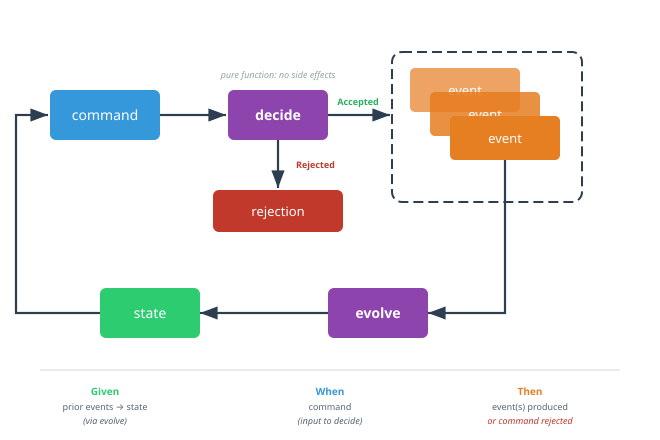

# ADR 002: Decider Pattern for Game Logic

## Context
We need a structure for the game engine that handles commands (player actions) and produces events. Common patterns:
1. Service classes with mutable state
2. Aggregate roots (DDD)
3. Decider pattern (functional)

## Decision
Use the **Decider pattern** with two pure functions:

```csharp
// Evolve: fold events into state
GameState Evolve(GameState state, GameEvent @event)

// Decide: validate command against state, produce events
Result<GameEvent[]> Decide(GameState state, GameCommand command)
```

Both functions use exhaustive pattern matching switches.



The cycle is closed: `state` feeds `decide`, which either rejects the command or emits `event`(s); `evolve` folds those events back into `state`. The bottom row shows how Given/When/Then test cases map onto the same flow.

## Rationale
- **Pure functions**: No side effects, easy to test
- **Exhaustive matching**: Compiler ensures all cases handled
- **emlang alignment**: Spec's `?test?` blocks map directly to Decide/Evolve calls
- **Single responsibility**: Evolve = "what happened", Decide = "what should happen"
- **Composable**: Can wrap with logging, validation, persistence without changing core logic

## Consequences
- All game logic lives in two functions
- State is always derived, never stored directly
- Pattern match switches may get large (but remain readable)
- No partial state updates—always full state reconstruction
- Natural fit for GWT testing: Given (events) → When (command) → Then (events/errors)

## References
- Jérémie Chassaing's Decider pattern
- Greg Young's event sourcing patterns
